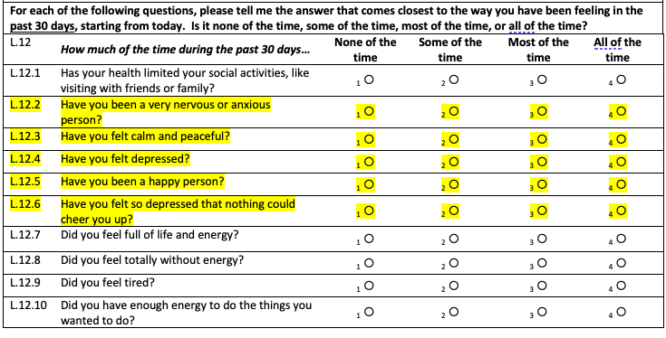

```{r setup, include=FALSE}
knitr::opts_chunk$set(echo = TRUE, results = "hide")
```

This is the first initial exploration of the Mfangano data for the fisher mental health paper. Will keep notes simple for now. 

```{r , echo = FALSE, include = FALSE}
#install.packages("tidyverse")
#install.packages("skimr")
#install.packages("ggpubr")
library(ggpubr) 
library(tidyverse) 
library(skimr)

```

Make folder paths

```{r}
projectFolder  <- "~/github/fisher_mental_health"
data <- file.path(projectFolder, "data/csv")
```

Bring in fish access file and morbidity fileS

```{r}
access <- read.csv(file.path(data, "tbl_I_FisheryAccess.csv"), na.strings=c("", "NA"))
morbidity <- read.csv(file.path(data, "tbl_L_Morbidity.csv"))

# create a vector of fisher IDs. Access qx only asked of fishers, so pulling from there.
fishers_only <- access %>% 
  select(ParticipantID) %>% 
  unique()

dim(fishers_only) # 269 unique fishers in the sample (though not all of them fished at all time periods)

```

**ORGANIZE FISHING ACCESS DATA**

There is a skip pattern in the questionnaire. 
"Access Limitations" questions differ slightly between fisher and non-fishers 
depending on whether they answer yes or no to I1: *"Have you fished or hired labor to fish in the last 3 months"*. 
If "no", answer questions in I2. If yes, answer questions in I3. 


Create a dataset for fishing behavior and motivation for **those who did not fish** in the past 3 months

Note: Variable names have suffix that represents their question number in first follow-up survey located at: Survey Instruments and Instructions/Questionnaires-03 Month Follow-Up. 
e.g. Module I, question 3.1 --> i31. 

```{r}
fishing_behavior_nf <- access %>% 
  mutate(fished_or_hired_3months_i1 = as.numeric(I1_FishedOrHiredLaborLastThreeMosYN),
         hired_ever_i21 = as.numeric(I21_HireLabor),
         leased_ever_i21 = as.numeric(I21_GoFishingUnderLease),
         self_ever_i21 = as.numeric(I21_GoFishingSelfEmployed),
         forpay_ever_i21 = as.numeric(I21_WorkAsHiredLabor),
         last_fished_i22 = as.character(I22_LastTimeFished), 
         stop_reason_i231 = as.character(I231_ReasonsStoppedFishing), 
         stop_reason_important_i232 = as.character(I232_MostImportantReasonStoppedFishing),
         stop_decision_money_i241a = as.numeric(I241_MoneyReceivedYN),
         stop_decision_money_why_i241b = as.character(I241_MoneyReceivedHow), 
         stop_decision_time_i242a = as.numeric(I242_TimeSpentFishingYN),
         stop_decision_time_why_i242b = as.character(I242_TimeSpentFishingHow),
         stop_decision_difficulty_i243a = as.numeric(I243_DifficultyFishingYN), 
         stop_decision_difficulty_why_i243b = as.character(I243_DifficultyFishingHow), 
         stop_decision_regulation_i244a = as.numeric(I244_RegulationsYN),
         stop_decison_regulation_why_i244b = as.character(I244_RegulationsHow), 
         stop_decision_enviro_i245a = as.numeric(I245_EnvironChangesYN), 
         stop_decision_enviro_why_i245b = as.character(I245_EnvironChangesHow)) %>% 
  select(TimePoint, ParticipantID, fished_or_hired_3months_i1, hired_ever_i21, 
         self_ever_i21, leased_ever_i21, forpay_ever_i21, last_fished_i22, starts_with("stop_"))
```

The above data frame should contain information for only those that answered "Yes" 
though there are some 0s that should be missing.

```{r}
colSums(!is.na(fishing_behavior_nf)) ## counting non-missing values
colSums(is.na(fishing_behavior_nf)) ## counting missing values
```

Replacing values of non-fisher variables with NA for those who fished (fishers = `fished_or_hired_3months == 1`)

```{r}

fishing_behavior_nf %>% 
  mutate_at(vars(hired_ever_i21, self_ever_i21, forpay_ever_i21, last_fished_i22,
                 starts_with("stop_")), ~replace(.,fished_or_hired_3months_i1 == 1, NA))
```

Create a dataset for fishing behavior and motivation for **those who reported fishing** in the past 3 months

```{r}
fishing_behavior_f <- access %>% 
  mutate(fished_or_hired_3months_i1 = as.numeric(I1_FishedOrHiredLaborLastThreeMosYN),
         hired_now_i31 = as.numeric(I31_HireLabor), 
         leased_now_i31 = as.numeric(I31_GoFishingUnderLease),
         self_now_i31 = as.numeric(I31_GoFishingSelfEmployed),
         forpay_now_i31 = as.numeric(I31_WorkAsHiredLabor),
         enough_fish_i32 = as.character(I32_LastThreeMonthsEnufFish), 
         quantity_change_i331 = as.character(I331_LastThreeMonthsQtyofFishChanged),
         quantity_effect_frequency_i332 = as.numeric(I332_ChangeAffectedHowOftenFishYN),
         quantity_effect_frequency_why_i333 = as.character(I333_ChangeAffectedHowOftenFishHow),
         quantity_effect_investment_i334 = as.numeric(I334_ChangeAffectedHowMuchMoneySpendYN),
         quantity_effect_investment_why_i335 = as.character(I335_ChangeAffectedHowMuchMoneySpendHow),
         limits_use_i34 = as.character(I34_LastThreeMonthsLimitsAbilityToUseFish),
         limits_use_most_i35 = as.character(I35_LastThreeMonthsMostImportantLimit),
         change_money_i36a = as.numeric(I36a_MoneyCanMakeYN),
         change_money_cause_i36b = as.character(I36b_MoneyCanMakeCauses),
         change_money_direction_i36c = as.character(I36c_MoneyCanMakeIncreaseDecrease),
         change_time_i37a = as.numeric(I37a_TimeSpentFishingYN),
         change_time_cause_i37b = as.character(I37b_TimeSpentFishingCauses),
         change_time_direction_i37c = as.character(I37c_TimeSpentFishingIncreaseDecrease),
         change_difficulty_i38a = as.numeric(I38a_DifficultyFishingYN),
         change_difficulty_cause_i38b = as.character(I38b_DifficultyFishingCauses),
         change_difficulty_direction_i38c = as.character(I38c_DifficultyFishingIncreaseDecrease),
         change_regulation_i39a = as.numeric(I39a_AllowedToFishYN),
         change_regulation_cause_i39b = as.character(I39b_AllowedToFishCauses),
         change_regulation_direction_i39c = as.character(I39c_AllowedToFishIncreaseDecrease),
         change_enviro_i310a = as.numeric(I310a_EnvironChangesYN),
         change_enviro_cause_i310b = as.character(I310b_EnvironChangesCauses),
         change_enviro_direction_i310c = as.character(I310c_EnvironChangesIncreaseDecrease), 
         shock_gearstolen_i311 = as.numeric(I311_GearsStolenYN),
         shock_gearconfiscated_i311 = as.numeric(I311_GearsConfiscatedYN),
         shock_hyacinth_i311 = as.numeric(I311_WaterHyacinthYN),
         shock_weather_i311 = as.numeric(I311_WeatherChangesYN),
         shock_fishdecline_i311 = as.numeric(I311_SevereFishDeclineYN),
         shock_pricedecline_i311 = as.numeric(I311_SevereFishPriceDeclineYN),
         shock_inputprice_i311 = as.numeric(I311_IncreaseGearLaborPricesYN),
         shock_illness_i311 = as.numeric(I311_IllnessFamilyMemberYN),
         shock_death_i311 = as.numeric(I311_DeathFamilyMemberYN),
         shock_other_i311 = as.numeric(I311_OtherYN),
         shock_otherspecify_i311 = as.character(I311_OtherSpecify)) %>% 
  select(TimePoint, ParticipantID, fished_or_hired_3months_i1, leased_now_i31, 
         self_now_i31, hired_now_i31, forpay_now_i31, enough_fish_i32, starts_with(c("quantity", "limits", "change", "shock")))
```

Replacing values of fisher variables with NA for those who didn't fish (non-fishers = `fished_or_hired_3months == 0`)

```{r}

fishing_behavior_f <- fishing_behavior_f %>% 
  mutate_at(vars(hired_now_i31, self_now_i31, forpay_now_i31, leased_now_i31, 
                 starts_with(c("quantity_", "limits", "change", "shock"))), ~replace(.,fished_or_hired_3months_i1 == 0, NA))
            
```


In some time points, the fishing access questionnaire includes likert scale questions about perecpetions/preferences related to fishing. Currently excluding these because it's not clear how I will use them, but I may bring them in later.

Next step is to combine the fisher and non-fisher data frames. The fisher and non-fisher data frames contain some overlapping variables (e.g. QI.1) but most variables are specific to whether an individual fished or did not fish.
```{r}
fishing_behavior <- full_join(fishing_behavior_f, fishing_behavior_nf, by = c("ParticipantID", "TimePoint"))

# cleaning up where the join duplicated fished_or_hired_3months_i1

x <- fishing_behavior %>% 
  mutate(diff = fished_or_hired_3months_i1.x - fished_or_hired_3months_i1.y) %>% 
  select(fished_or_hired_3months_i1.x, fished_or_hired_3months_i1.y, diff) 
table(x$diff)

fishing_behavior <- fishing_behavior %>% 
  mutate(fished_i1 = fished_or_hired_3months_i1.x) 

# What is frequency of fishing vs not fishing, among fishers?
table(fishing_behavior$fished_i1)

```


**ORGANIZE MORBIDITY DATA**

Pulling out the questions that I think pertain to the MOS-HIV, which is the HIV-oriented quality of life scale that contains mental health questions. There are a number of other questions in the survey that are not included here. Once I know the extent to which we need them, I will add them. 

The majority of the questions in this section are on the following scale: 1 = none of the time; 2 = some of the time; 3 = most of the time, 4 = all of the time. They are saved as strings and I would like to save them as numeric, so I also parse them below.

```{r}
moshiv <- morbidity %>% as_tibble() %>% 
  mutate(health_l1 = L1_HealthStatus,
         pain_l1 = L2_PainPastThirtyDays,
         social_limit_l121 = parse_number(L121_HealthLimitSocialActivities_FreqID), 
         anxious_l122 = parse_number(L122_NervousAnxious_FreqID),
         calm_l123 = parse_number(L123_CalmPeaceful_FreqID),
         depressed_l124 = parse_number(L124_Depressed_FreqID),
         happy_l125 = parse_number(L125_Happy_FreqID),
         depressed_extra_l126 = parse_number(L126_VeryDepressed_FreqID),
         energy_full_l127 = parse_number(L127_FullLifeEnergy_FreqID), 
         energy_none_l128 = parse_number(L128_WithoutEngery_FreqID),
         tired_l129 = parse_number(L129_Tired_FreqID),
         energy_enough_l1210 = parse_number(L1210_EnoughEnergy_FreqID),
         weighed_down_health_l1211 = parse_number(L1211_WeighedDownByHealth_FreqID),
         discouraged_health_l1212 = parse_number(L1212_DiscouragedByHealth_FreqID),
         despair_health_l1213 = parse_number(L1213_DespairOverHealth_FreqID), 
         afraid_health_l1214 = parse_number(L1214_AfraidBecauseHealth_FreqID), 
         reasoning_difficulty_l1215 = parse_number(L1215_DifficultyReasoningDecisions_FreqID), 
         forgetting_l1216 = parse_number(L1216_ForgotThings_FreqID), 
         attention_l1217 = parse_number(L1217_TroubleKeepingAttention_FreqID),
         concentration_l1218 = parse_number(L1218_DifficultyConcentrationThinking_FreqID),
         lifequality_l14 = L14_QualityOfLife) %>% 
  select(TimePoint, ParticipantID, (starts_with(c("health", "pain", "social", "anxious", "calm", "depressed", "happy", "energy", "tired", "weighed", "discouraged", "despair", "afraid", "reasoning", "forgetting", "attention", "concentration", "life" ))))

```

Focusing on Mental Health Subscale in exploration below.  The original MOS-HIV uses a scale of 1-6, so scaling is different. 
Larger values --> better mental health. 

```{r}
mh_sub <- moshiv %>% 
  select(TimePoint, ParticipantID, anxious_l122, calm_l123, happy_l125, depressed_l124, depressed_extra_l126)

dim(mh_sub) #3779 observations
```

Extract only fisher information from the MH subscale data. We may do analysis with mothers later, but not at this time. 

```{r}
fisher_mh <- left_join(fishers_only, mh_sub, by = "ParticipantID")
nrow(fisher_mh) # 1347 fisher obs (approx 5 obs per fisher, which seems correct)

```

What does the time series look like? 

```{r, results = "hold"}
table(fisher_mh$TimePoint, useNA = "always")

```

It looks like data were collected in time point 0, which I didn't realize. Time point 9, 15 and 21 each have a single observation. Examining them more closely.
There is also a missing value in time point, which I will remove. 

```{r, results = "hold"}

print(filter(fisher_mh, TimePoint == 9)) # values are non-zero. Could there be an error in the TimePoint coding? 
print(filter(fisher_mh, ParticipantID == "E0092")) # This individual is responsible for the observations in periods 9, 15, and 21. They also have a value for the other time points. 

print(filter(fisher_mh, is.na(fisher_mh$TimePoint) == "TRUE")) # Participant W0571 has all missing values.
print(filter(fisher_mh, ParticipantID == "W0571")) 


```
The completely blank observation is for individual W0571. We will drop this value below.
The three single observations are for the same individual (E0092) and are non-zero values. Even if these data were erroneously collected for this person in other time periods, we cannot use them in analysis because we need >1 observation at each time point. Therefore I am dropping this individual's time points 9, 15, and 21, but keeping the rest. 

```{r, results = "hold", error = TRUE}
begin <- nrow(fisher_mh) # setting up a check to make sure I drop only 4 obs

fisher_mh <- fisher_mh %>% 
  filter(ParticipantID != "W0571", TimePoint != 9, TimePoint != 15, TimePoint != 21) 

end <- nrow(fisher_mh)

stopifnot((begin - end) == 4) # confirm that we drop 4 observations

rm(begin, end)

```

Recoding key variables:
Recoding TimePoint into a numeric series for easier plotting.
Recoding anxious and depressed variables so that higher number is positive state.

 

```{r}
# recoding TimePoint
# table(fisher_mh$TimePoint)
# 
# fisher_mh <- fisher_mh %>%
#   mutate(period = recode(TimePoint,
#                          "0" = "1",
#                          "3" = "2",
#                          "6" = "3",
#                          "12" = "4",
#                          "18" = "5",
#                          "24" = "6",
#                          .default = "99"))
# 
# table(fisher_mh$period)

fisher_mh_recode <- fisher_mh %>% 
  mutate(depressed_l124 = recode(depressed_l124,
                                 "1" = "4", 
                                 "2" = "3", 
                                 "3" = "2", 
                                 "4" = "1"),
         depressed_extra_l126 = recode(depressed_extra_l126,
                                 "1" = "4", 
                                 "2" = "3", 
                                 "3" = "2", 
                                 "4" = "1"),
         anxious_l122 = recode(anxious_l122,
                                 "1" = "4", 
                                 "2" = "3", 
                                 "3" = "2", 
                                 "4" = "1"))


fisher_mh_recode <- fisher_mh_recode %>% 
  mutate(anxious_l122 = as.numeric(anxious_l122), 
         depressed_l124  = as.numeric(depressed_l124),
         depressed_extra_l126 =as.numeric(depressed_extra_l126))
```

For each fisher at each time point, we need to combine the five subscale variables to create and scale the sub-scale.

```{r}

fisher_mh_recode <- fisher_mh_recode %>% 
  mutate(total = (depressed_l124 + depressed_extra_l126 + anxious_l122 + calm_l123 + happy_l125))
         
minn <- 5
maxx <- 20
fisher_mh_recode <- fisher_mh_recode %>% 
  mutate(mh_subscale = (100/(maxx-5)) * (total - minn))

```

Keeping only relevant variables

```{r}
fisher_mh_subscale <- fisher_mh_recode %>% 
  select(ParticipantID, TimePoint, mh_subscale)
```


**COMBINE MORBIDITY AND FISHER BEHAVIOR DATA FRAMES**
```{r}

fishers <- full_join(fisher_mh_subscale, fishing_behavior, key = c("ParticipantID", "TimePoint"))

# cleaning up workspace before visualizing some things

rm(access, fisher_mh, fisher_mh_recode, fishing_behavior, fishing_behavior_f, fishing_behavior_nf, maxx, minn, mh_sub, morbidity, x, moshiv)

# using TimePoint to create "period" variable that we can treat as numeric for time series analysis
table(fishers$TimePoint, useNA = "always")

fishers <- fishers %>% 
  mutate(period = as.numeric(recode(TimePoint,
                         "0" = "1",
                         "3" = "2",
                         "6" = "3", 
                         "12" = "4",
                         "18" = "5",
                         "24" = "6",
                         .default = "99"))) # i think this sets missing values to 99

table(fishers$period)


```


**VISUALIZE FISHER MENTAL HEALTH DATA**

Key takeaways from plots/tables below, as of 12/24/2021:

* The variation is not impressive. 
* The bulk of the sample is in the "some of the time" or "none of the time" categories, not "most of the time" or "all of the time". 
* The bulk of the movement seems to be between "some of the time" and "none of the time" too

Ideas for next steps: 

* What do mothers' mental health subscales look like? 
  * How different are they from fishers?
  * Are they collected at every time point?


Plotting fisher mental health subscale over time.

```{r}

ggplot(data = fishers) +
  geom_jitter(mapping = aes(x = period , y = mh_subscale)) 
ggsave("../images/mh_scatter_by_period.png")

histogram <- ggplot(fishers) +
  geom_histogram(mapping = aes(x = mh_subscale)) +
  facet_wrap(~ period)
ggsave("../images/mh_histogram_by_period.png")

ggplot(fishers) +
  geom_density(mapping = aes(x = mh_subscale)) +
  facet_wrap(~ period)
ggsave("../images/mh_density_by_period.png")

```


I now want to know some summary statistics. What is the overall mean, the mean by period and the within-person mean. 
```{r, results = "hold"}

# summary statistics by period
fishers %>% 
  group_by(period) %>% 
  summarise(mean = mean(mh_subscale), median = median(mh_subscale), sd = sd(mh_subscale)) %>% 
  knitr::kable(caption = "Fisher MH subscale by period")

ggplot(fishers, aes(x = as.factor(period), y = mh_subscale)) +
  geom_boxplot() +
  labs(title = "Mental Health Subscale by period")
ggsave("../images/mh_boxplot_by_period.png")

```

Quick calculation of within-household mean and SD. 
```{r, results = "hold"}
within_means <- fishers %>% 
  group_by(ParticipantID) %>% 
  summarise(mean = mean(mh_subscale), sd = sd(mh_subscale)) 
within_means %>% 
  summarise(mean1 = mean(mean), sd = sd(mean)) %>% 
  knitr::kable(caption = "Within-fisher mean and SD")
            
```

```{r}

ggplot(within_means) +
  geom_histogram(mapping = aes(x = mean)) +
  labs(title = "Distribution of within-household means of Mental Health Subscale scores")

ggplot(within_means) +
  geom_histogram(mapping = aes(x = sd)) +
  labs(title = "Distribution of within-household standard deviations of Mental Health Subscale scores")

```


**VISUALIZE FISHER BEHAVIOR**

Fishers' decision to fish over time is pretty stable on average across fishers. On average, 60-70% of fishers fished in the past 3 months.
```{r}

# Examining missing values of fisher behavior. There are 15 cases with no clear pattern in terms of time point. Individual EOO92 is missing five time points.
fishers %>% 
  filter(is.na(fished_i1)) # all missing cases of fished_i1 --> completely missing fisher behavior
fishers %>% 
  filter(is.na(period))

# Filtering out missing fisher behavior data and summarizing by period
fishers %>% 
  filter(!is.na(fished_i1)) %>% 
  group_by(period) %>% 
  summarise(mean = mean(fished_i1, na.rm = TRUE), sd = sd(fished_i1, na.rm = TRUE)) %>% 
  ggplot(decision, mapping = aes(x = period, y = mean)) +
  geom_path(group = 1) +
  ylim(0, 1) +
  labs(title = "Share of fishers who fished in any given period", y = "Share", x = "Period")
  

```


Fishing behavior among those that fished
Among those that fished, 

Fishing behavior among those that did not fish
Among those that did not fish, very few cited environmental concerns that contributed to them not fishing.

```{r}
fishers %>% 
  filter(fished_i1 == 1) %>% 
  #select(stop_decision_enviro_i245a) %>% 
  summarise(yes = n())
  knitr::kable()

doink <- fishers %>% 
  filter(fished_i1 == 1) %>% 
  select(stop_decision_enviro_i245a) %>% 
  mutate(yes = as.numeric(stop_decision_enviro_i245a == 1),
         no = as.numeric(stop_decision_enviro_i245a == 0))

table(doink$yes)
table(doink$no)


  group_by(stop_decision_enviro_i245a) %>% 
  summarize(n = n())
  
  knitr::kable()
  
table(fishers$stop_decision_enviro_i245a, useNA = "always")
```


