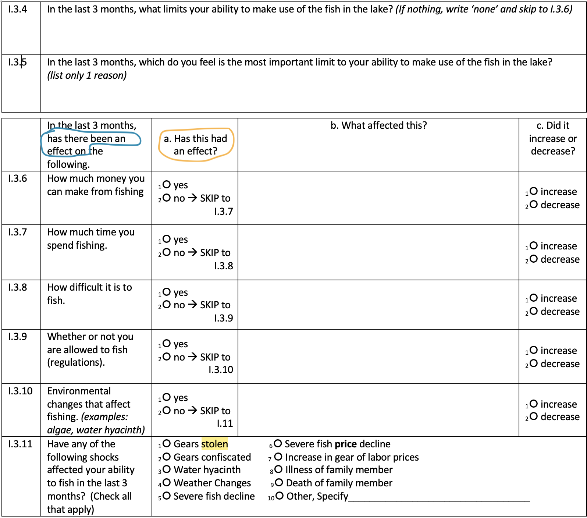

```{r setup, include=FALSE}
knitr::opts_chunk$set(echo = TRUE)
```


Bring in fish access file

```{r}

access <- read.csv(file.path(data, "tbl_I_FisheryAccess.csv"), na.strings = c("", "NA"))

# create a vector of fisher IDs. Access qx only asked of fishers, so pulling from there.
fishers_only <- access %>% 
  select(ParticipantID) %>% 
  unique()

dim(fishers_only) # 269 unique fishers in the sample (though not all of them fished at all time periods)

```


**ORGANIZE FISHING ACCESS DATA**

There is a skip pattern in the questionnaire. 
"Access Limitations" questions differ slightly between fisher and non-fishers 
depending on whether they answer yes or no to I1: *"Have you fished or hired labor to fish in the last 3 months"*. 
If "no", answer questions in I2. If yes, answer questions in I3. 

The dataset should contain the following variables. 

I.1 Have you fished, or hired labor to fish, in the last 3 months. 

People who did not fish: 
I.2.3.1 What are the reasons you (or your fishing operation) stopped fishing? (Open ended)
I.2.3.2 What is the most important reason you (or your fishing operation) stopped fishing?
I.2.4.1 Did how much money you can make from fishing affect your decision to stop fishing?
I.2.4.2 Did how much time you spend fishing affect your decision to stop fishing?
I.2.4.3 Did how difficult it is to fish affect your decision to stop fishing?
I.2.4.4 Did whether or not you are allowed to fish (regulations) affect your decision to stop fishing?
I.2.4.5 Did environmental changes that affect fishing (examples: algae, water hyacinth, etc) affect your decision to stop fishing?

People who reported fishing: 
I.3.4 In the last 3 months, what limits your ability to make use of the fish in the lake? (If nothing, write ‘none’ and skip to I.3.6)
I.3.5: In the last 3 months, which do you feel is the most important limit to your ability to make use of the fish in the lake?
(list only 1 reason)
I.3.6 How much money you can make from fishing
I.3.7 How much time you spend fishing.
I.3.8 How difficult it is to fish. 
I.3.9 Whether or not you are allowed to fish (regulations). 
I.3.10 Environmental changes that affect fishing. (examples: algae, water hyacinth)

The following question appears to have only been asked of those who fish, so it may not be useful. Will need to confirm this is the case. The shocks described in this section could be considered limitations to access.
I.3.11 Have any of the following shocks affected your ability to fish in the last 3 months?  


```{r}
# Create a dataset with the access perception variables
i <- access %>% 
  mutate(fished = as.numeric(I1_FishedOrHiredLaborLastThreeMosYN),
         money_nf = as.numeric(I241_MoneyReceivedYN),
         money_f = as.numeric(I36a_MoneyCanMakeYN), 
         time_nf = as.numeric(I242_TimeSpentFishingYN),
         time_f = as.numeric(I37a_TimeSpentFishingYN),
         difficulty_nf = as.numeric(I243_DifficultyFishingYN),
         difficulty_f = as.numeric(I37a_TimeSpentFishingYN),
         regulation_nf = as.numeric(I244_RegulationsYN),
         regulation_f = as.numeric(I39a_AllowedToFishYN),
         enviro_nf = as.numeric(I245_EnvironChangesYN),
         enviro_f = as.numeric(I310a_EnvironChangesYN)) %>% 
  select(ParticipantID, TimePoint, fished, money_nf, money_f, time_nf, time_f, difficulty_nf, difficulty_f, regulation_nf, regulation_f, enviro_nf, enviro_f) %>% 
  mutate(money = (money_nf + money_f),
         time = (time_nf + time_f), 
         difficulty = (difficulty_nf + difficulty_f),
         regulation = (regulation_nf + regulation_f),
         enviro = (enviro_nf + enviro_f))

```

The above data set includes the fisher/non-fisher variables, both separately (_nf, _f suffixes) and combined. 
I also combine them into a single vector. The way the questionnaire is set up, slightly different questions are asked of those who fished in the previous three months versus those who did not fish. 

Those who did not fish were asked "Did the following affect your decision to stop fishing?" and then asks about money, time, difficulty, regulations and environmental factors. We can interpret this as an access constraint that ultimately led to the individual ceasing to fish.


Those who fished in the last period were asked seemingly analogous questions, but the structure of the questionnaire is a bit less straightforward. For each item (money, time, difficulty, regulations, environmental--analogous to above), they are first asked "In the last three months, have there been an effect on the following?" and "Has this had an effect?" with a single Yes/No answer choice for those two questions. It is not clear whether the intent here is to know whether X has been affected by some outside factor (blue circle) X has changed something about the fisher's experience (yellow circle). The follow-up question, "What affected this?" seems to imply the former, but the fact that the items are analogous to the questions asked by non-fishers, plus the phrasing of the yellow circled section suggests that maybe the intention to identify the challenges that are faced by people who are fishing. This could be interpreted as an access constraint that does not rise to the level that the respondent quits fishing.  




