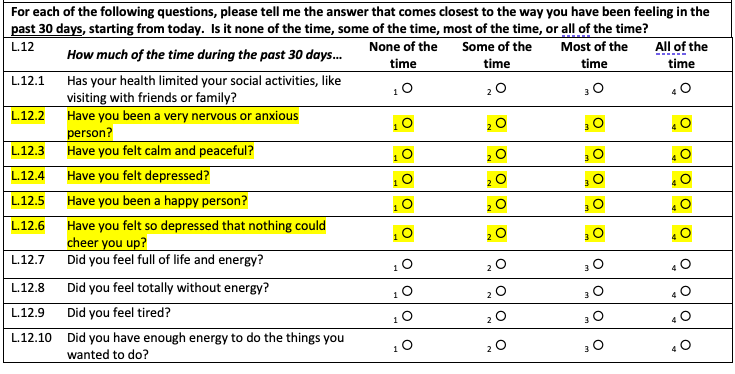

```{r setup, include=FALSE}
knitr::opts_chunk$set(echo = TRUE, collapse = TRUE)
```

```{r, echo = FALSE, include = FALSE}
# RMarkdown's insistence on file paths and packages in the same file
library(tidyverse) 
library(tidyr)
library(infer)

library(ggpubr) #install.packages("ggpubr")
#projectFolder  <- "~/github/fisher_mental_health"
#data <- file.path(projectFolder, "data/csv")

load("demog")

```
Bring in morbidity files

```{r}
morbidity <- read.csv(file.path(data, "tbl_L_Morbidity.csv"))

```


**ORGANIZE MORBIDITY DATA**

Pulling out the questions that I think pertain to the MOS-HIV, which is the HIV-oriented quality of life scale that contains mental health questions. There are a number of other questions in the survey that are not included here. Once I know the extent to which we need them, I will add them. 

The majority of the questions in this section are on the following scale: 1 = none of the time; 2 = some of the time; 3 = most of the time, 4 = all of the time. They are saved as strings and I would like to save them as numeric, so I also parse them below.

```{r}
moshiv <- morbidity %>% as_tibble() %>% 
  mutate(health_l1 = L1_HealthStatus,
         pain_l1 = L2_PainPastThirtyDays,
         social_limit_l121 = parse_number(L121_HealthLimitSocialActivities_FreqID), 
         anxious_l122 = parse_number(L122_NervousAnxious_FreqID),
         calm_l123 = parse_number(L123_CalmPeaceful_FreqID),
         depressed_l124 = parse_number(L124_Depressed_FreqID),
         happy_l125 = parse_number(L125_Happy_FreqID),
         depressed_extra_l126 = parse_number(L126_VeryDepressed_FreqID),
         energy_full_l127 = parse_number(L127_FullLifeEnergy_FreqID), 
         energy_none_l128 = parse_number(L128_WithoutEngery_FreqID),
         tired_l129 = parse_number(L129_Tired_FreqID),
         energy_enough_l1210 = parse_number(L1210_EnoughEnergy_FreqID),
         weighed_down_health_l1211 = parse_number(L1211_WeighedDownByHealth_FreqID),
         discouraged_health_l1212 = parse_number(L1212_DiscouragedByHealth_FreqID),
         despair_health_l1213 = parse_number(L1213_DespairOverHealth_FreqID), 
         afraid_health_l1214 = parse_number(L1214_AfraidBecauseHealth_FreqID), 
         reasoning_difficulty_l1215 = parse_number(L1215_DifficultyReasoningDecisions_FreqID), 
         forgetting_l1216 = parse_number(L1216_ForgotThings_FreqID), 
         attention_l1217 = parse_number(L1217_TroubleKeepingAttention_FreqID),
         concentration_l1218 = parse_number(L1218_DifficultyConcentrationThinking_FreqID),
         lifequality_l14 = L14_QualityOfLife) %>% 
  select(TimePoint, ParticipantID, (starts_with(c("health", "pain", "social", "anxious", "calm", "depressed", "happy", "energy", "tired", "weighed", "discouraged", "despair", "afraid", "reasoning", "forgetting", "attention", "concentration", "life" ))))

```

The dataset created at this point contains the full MOS-HIV, however, I am focusing on Mental Health Subscale in subsequent exploration.  

The next few steps bring in fisher and mother files to identify which ParticipantIDs are male and female.

```{r}
mh_sub <- moshiv %>% 
  select(TimePoint, ParticipantID, anxious_l122, calm_l123, happy_l125, depressed_l124, depressed_extra_l126) %>% 
  left_join(fishers_only, by = "ParticipantID") %>% 
  left_join(mothers_only, by = "ParticipantID")

dim(mh_sub)  # 3782    9
head(mh_sub)


dim(mh_sub) #3779 observations

```


```{r, include = FALSE}
# Confirm that we don't have people who listed as both male and female (fisher and mother), or neither

head(mh_sub %>% 
       filter(male == female)) 
```


What does the time series look like? I  know the data are collected at different time points for mothers than for fishers, so I am going to look at them separately.

```{r, results = "hold"}

fishers <- mh_sub %>% 
  filter(male == 1) %>% 
  group_by(TimePoint) %>% 
  summarize(n = n()) 

mothers <- mh_sub %>% 
  filter(female == 1) %>% 
  group_by(TimePoint) %>% 
  summarize(n = n()) 

fishers
mothers


```


Recoding anxious and depressed variables so that higher number is positive state, per the MOS-HIV manual

```{r}

mh_recode <- mh_sub %>% 
  mutate(depressed_l124 = recode(depressed_l124,
                                 "1" = "4", 
                                 "2" = "3", 
                                 "3" = "2", 
                                 "4" = "1"),
         depressed_extra_l126 = recode(depressed_extra_l126,
                                 "1" = "4", 
                                 "2" = "3", 
                                 "3" = "2", 
                                 "4" = "1"),
         anxious_l122 = recode(anxious_l122,
                                 "1" = "4", 
                                 "2" = "3", 
                                 "3" = "2", 
                                 "4" = "1"))


mh_recode <- mh_recode %>% 
  mutate(anxious_l122 = as.numeric(anxious_l122), 
         depressed_l124  = as.numeric(depressed_l124),
         depressed_extra_l126 =as.numeric(depressed_extra_l126))
```

For each fisher at each time point, we need to combine the five subscale variables to create and scale the sub-scale. The original MOS-HIV MH Subscale uses a scale of 1-6, so scaling will need to be adjusted. 

```{r}

mh_recode <- mh_recode %>% 
  mutate(total = (depressed_l124 + depressed_extra_l126 + anxious_l122 + calm_l123 + happy_l125))
         
minn <- 5
maxx <- 20
mh_recode <- mh_recode %>% 
  mutate(mh_subscale = (100/(maxx-5)) * (total - minn))

```

Keeping only relevant variables, generating a period variable for plotting, and replacing NAs with zero for male/female binary vars

```{r}
mh_recode <- mh_recode %>% 
  select(ParticipantID, TimePoint, mh_subscale, male, female)

mh_recode <- mh_recode %>%
  mutate(period = recode(TimePoint,
                         "0" = "1",
                         "3" = "2",
                         "6" = "3",
                         "9" = "4",
                         "12" = "6",
                         "15" = "7",
                         "18" = "8",
                         "21" = "9",
                         "24" = "10",
                         .default = "99")) %>% 
  mutate(period = as.numeric(period)) %>% 
  mutate(male = replace_na(male, 0)) %>% 
  mutate(female = replace_na(female, 0)) %>% 
  mutate(gender = ifelse(male == 1, "male", "female"))

```


**VISUALIZE FISHER MENTAL HEALTH DATA**

Key takeaways from plots/tables below, as of 12/24/2021:

* The variation is not impressive. 
* The bulk of the sample is in the "some of the time" or "none of the time" categories, not "most of the time" or "all of the time". 
* The bulk of the movement seems to be between "some of the time" and "none of the time" too

Ideas for next steps: 

* What do mothers' mental health subscales look like? 
  * How different are they from fishers?
  * Are they collected at every time point?


Plotting fisher mental health subscale over time. Only the most relevant plots will appear in knitted document.

```{r, include = FALSE}

mh_recode %>% 
  filter(male == 1) %>% 
  ggplot() +
  geom_jitter(mapping = aes(x = period , y = mh_subscale)) 
#ggsave("../images/mh_scatter_by_period.png")

mh_recode %>% 
  filter(male == 1) %>% 
  ggplot() +
  geom_histogram(mapping = aes(x = mh_subscale)) +
  facet_wrap(~ period)
#ggsave("../images/mh_histogram_by_period.png")

mh_recode %>% 
  filter(male == 1) %>% 
  ggplot() +
  geom_density(mapping = aes(x = mh_subscale)) +
  facet_wrap(~ period)
#ggsave("../images/mh_density_by_period.png")
```

```{r, include = FALSE}

# Boxplot of men over time
mh_recode %>% 
  filter(male == 1) %>% 
  ggplot(aes(x = as.factor(period), y = mh_subscale)) +
  geom_boxplot() +
  labs(title = "Men's Mental Health Subscale by period")
ggsave("../images/mh_boxplot_by_period_men.png")

# Boxplot of women over time
mh_recode %>% 
  filter(female == 1) %>% 
  ggplot(aes(x = as.factor(period), y = mh_subscale)) +
  geom_boxplot() +
  ylim(0,100) +
  labs(title = "Women's Mental Health Subscale by period")
ggsave("../images/mh_boxplot_by_period_women.png")
```

```{r, echo = FALSE, message = FALSE}

ggboxplot(mh_recode, x = 'male', y = "mh_subscale", 
          color = "male", palette = c("#00AFBB", "#E7B800"),
          ylab = "Mental health score", xlab = "Gender")

gendermean <- mh_recode %>% 
  filter(!is.na(mh_subscale)) %>% 
  group_by(gender) %>% 
  summarize(mean = mean(mh_subscale))
femalemean <- gendermean[1,2]
malemean <- gendermean[2,2]

mh_recode %>% 
  filter(!is.na(mh_subscale)) %>% 
  ggplot(aes(x = as.factor(TimePoint), y = mh_subscale)) +
  geom_boxplot() +
  facet_wrap(~ gender) +
  ylim(0,100) +
  labs(title = "Mental Health Subscale by period and gender", x = "Months", y = "Mental Health Score")
ggsave("../images/mh_boxplot_by_period_women.png")
```

```{r, echo = FALSE}

mh_recode %>% 
  filter(male == 1 & !is.na(mh_subscale)) %>% 
  group_by(period) %>% 
  summarise(mean = mean(mh_subscale), median = median(mh_subscale), sd = sd(mh_subscale), n = n()) %>% 
  knitr::kable(caption = "Fisher MH subscale by period (Male)")

mh_recode %>% 
  filter(female == 1 & !is.na(mh_subscale)) %>% 
  group_by(period) %>% 
  summarise(mean = mean(mh_subscale), median = median(mh_subscale), sd = sd(mh_subscale), n = n()) %>% 
  knitr::kable(caption = "Fisher MH subscale by period (Female)")

```

I want to better understand the within-person variation in these values. Thinking about stability/variablity vs. levels. 


```{r, include = FALSE}

# Quick calculation of within-household mean and SD. 
within <- mh_recode %>% 
  filter(!is.na(mh_subscale)) %>% 
  group_by(ParticipantID, gender) %>% 
  summarize(mean = mean(mh_subscale), min = min(mh_subscale), max = max(mh_subscale), sd = sd(mh_subscale)) %>% 
  mutate(sd = ifelse(is.na(sd), 0, sd))
```


The next shows the distribution of within-person means by gender. The distribution of within-person means is slightly wider for men and women, though the means (as illustrated above) appear to be quite similar. The following plot shows the distribution of within-person variation (SD) in the mental health subscale. We don't see much difference in the levels (as illustrated above), but we do see some difference in the variability. On average, women's variability is a bit lower than men. There are more men reporting greater variability (e.g. SD > 20) compared to women.

```{r, echo = FALSE}

# Plot within means
within %>% 
  ggplot(aes(x = mean)) +
  geom_density() +
  facet_wrap(~ gender) +
  labs(title = "Distribution of within-person means of mental health subscale", x = "Within-person mean", y = "Density")

```

```{r, echo = FALSE}
# Plot standard deviation
within %>% 
  ggplot(aes(x = sd)) +
  geom_density() +
  facet_wrap(~ gender) +
  labs(title = "Distribution of within-person SD of mental health subscale", x = "Within-person standard deviation", y = "Density")

```


Ideas for next steps:

- Disaggregate by HIV status
  - this means you have to find/clean the HIV status data
- What are determinants of levels?
- What are determinants of variability? 
    e.g. do women with HIV have different levels?
    e.g. do women with HIV have more or less variation?
    
- Get back to thinking about how access plays into this
  - clean/organize access data in its own script


